# PetLife Game

## A pet game where you take care of a virtual pet written in C++ using the SFML library.

### :video_camera: YouTube Demo (Click the Photo)
---------------------------------------------------------------------------------
[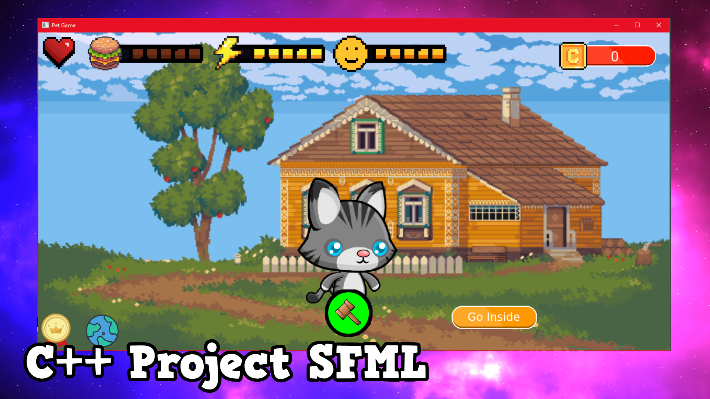](https://youtu.be/TkDPbkyYqeA?si=ZSP4Ax89ST9WxmON)

---------------------------------------------------------------------------------

### :arrow_right: About
---------------------------------------------------------------------------------
This Project is a Game made using the SFML Library, where the player takes care of a virtual cat by playing minigames and monitoring the bars such as how satiated, energetic, and happy the cat is. The player must make sure that the health does not go to 0 and can purchase new maps using currency earned by caring for the cat.
- When any 2 bars are empty, the health goes down.
- If a bar is at 2 or less, the player earns a coin for filling it back up (else they get no reward)
- The game has 2 difficulty levels
- There is an unclean debuff, where the bars go down faster while it is active, only removed by bathing

---------------------------------------------------------------------------------

### :desktop_computer: Quickstart
---------------------------------------------------------------------------------
This project is made in SFML, so it is all sorted all ready for you to play as the DLLs and Assets are included.

To play simply :
1. Clone this project
2. Run the PetLife.exe

---------------------------------------------------------------------------------

### :camera_flash: Screenshots
---------------------------------------------------------------------------------
#### Outside (The cat stood outside, the minigame here will refill the entertainment bar)
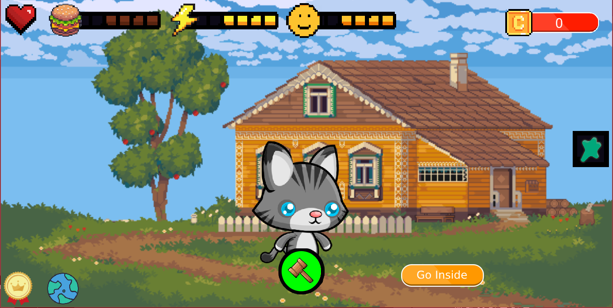

#### PlayAroundMinigame (This minigame will refill the entertainment bar. Button locked when full.)
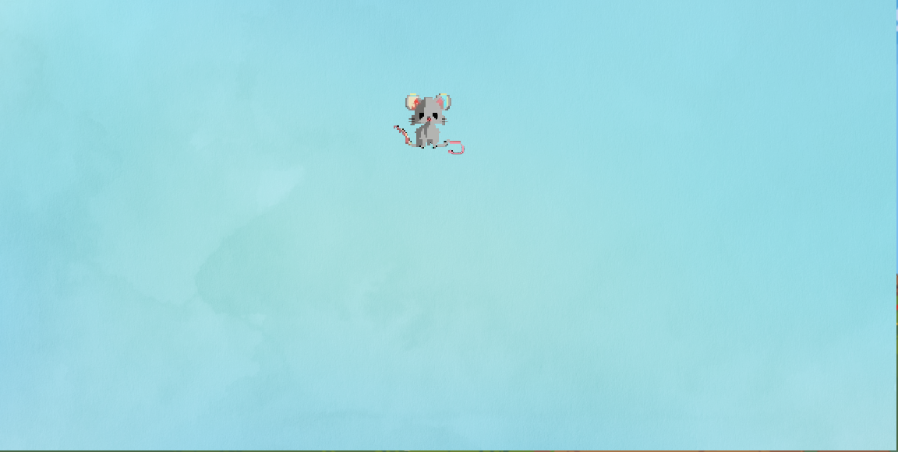

#### EntryWay (The player can only leave the house from here)
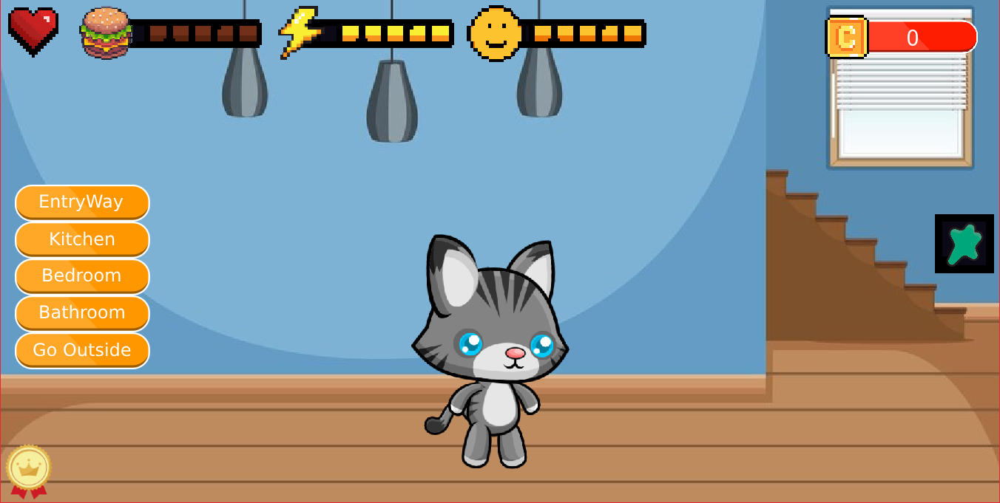

#### Kitchen (The player can play the eating minigame to refill the hunger bar)
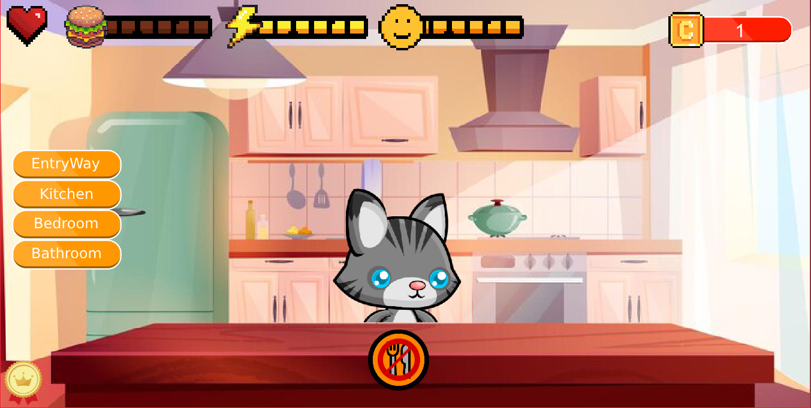

#### EatingMinigame (The player can play the eating minigame to refill the hunger bar. Button locked when full.)
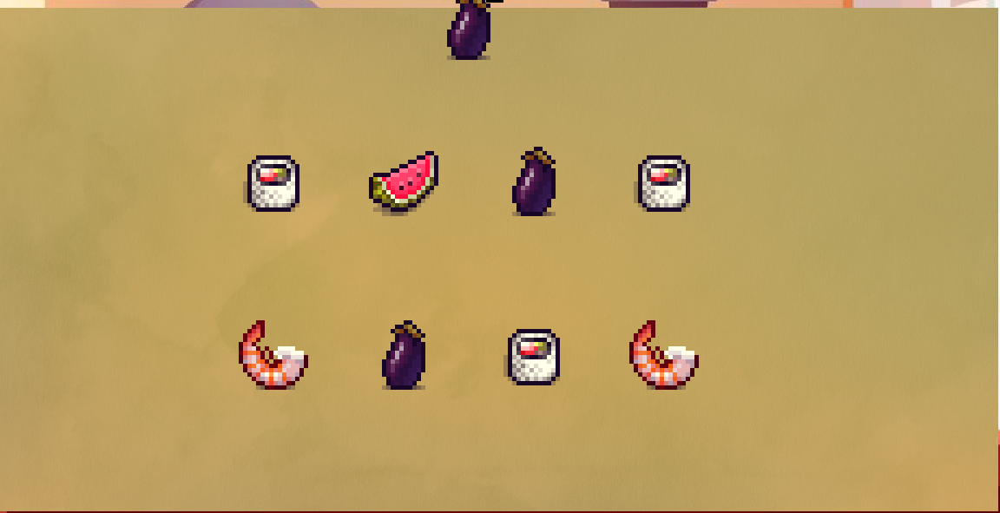

#### Bedroom (The player can sleep the cat here, to refill the energy bar)
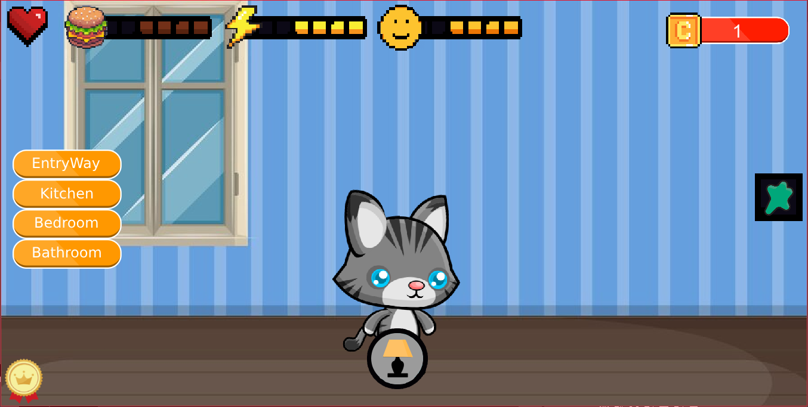

#### Sleeping (The player can sleep the cat, to refill the energy bar.)
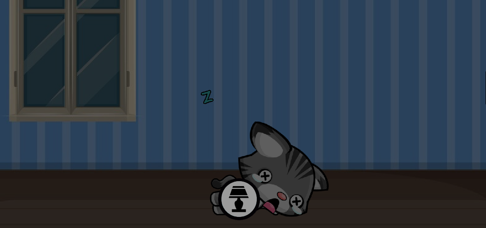

#### Bathroom (The player can play the bath minigame here, to remove the unclean debuff)
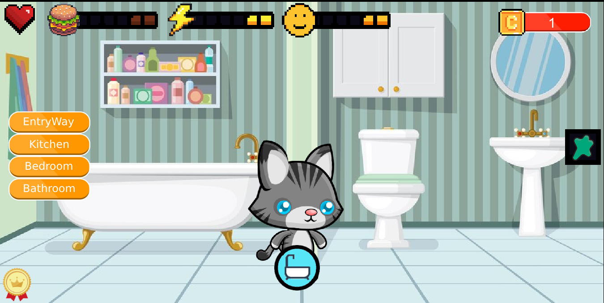

#### BathMinigame (The player can play the bath minigame, to remove the unclean debuff. Button locked when no Debuff.)
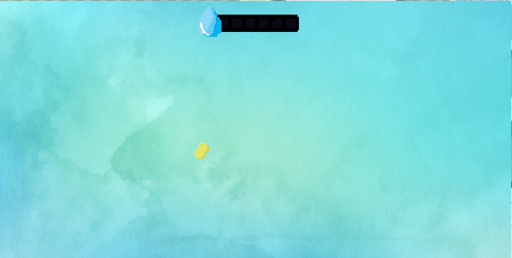

#### UncleanDebuff (This appears after a set amount of time and speeds up the bar decrementing)

#### MapShop (The player can purchase new maps here)
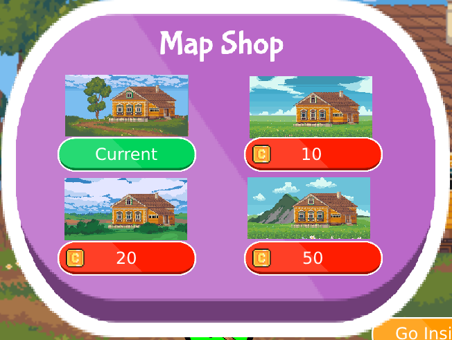

#### Difficulty (The player can select the difficulty here)
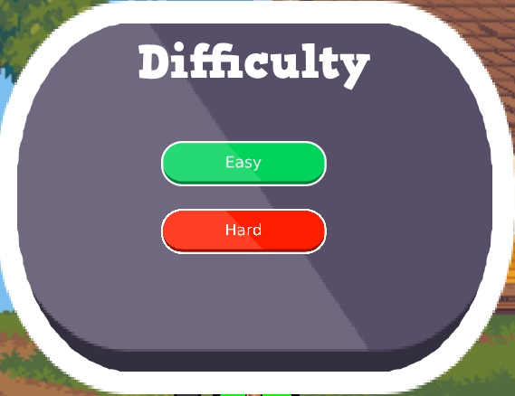

#### Currency (This is used to purchase new maps)

#### GameOver (This is shown when the health goes to 0, and the player keeps their maps when they restart after GameOver)
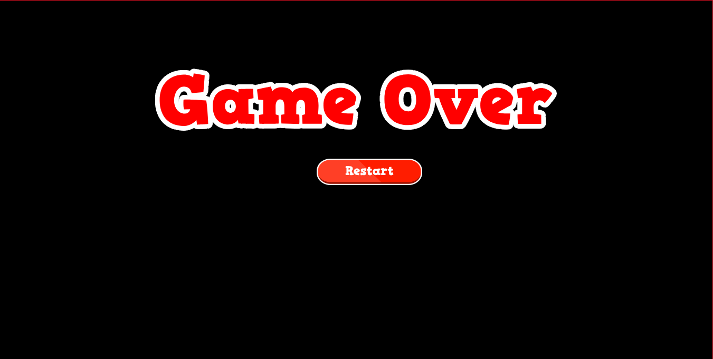

#### The bars (Display the cat's state for each attribute)

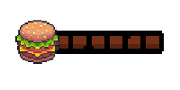

---------------------------------------------------------------------------------

### :abacus: Performance
---------------------------------------------------------------------------------
#### Multithreading and Parallel Processing
This is used to load the assets as fast as possible at the start so you can get into the game quickly.

#### Asynchronous Processing
Any assets that aren't immediately required, are loaded asynchronously, such as the other maps and the debuff symbol.

---------------------------------------------------------------------------------
